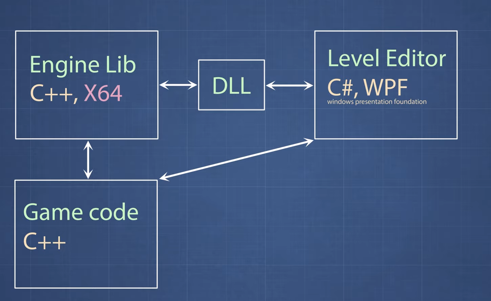
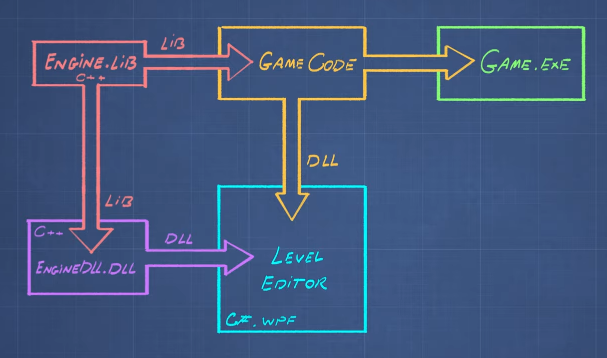
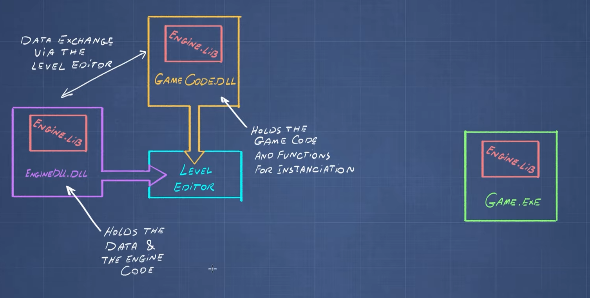
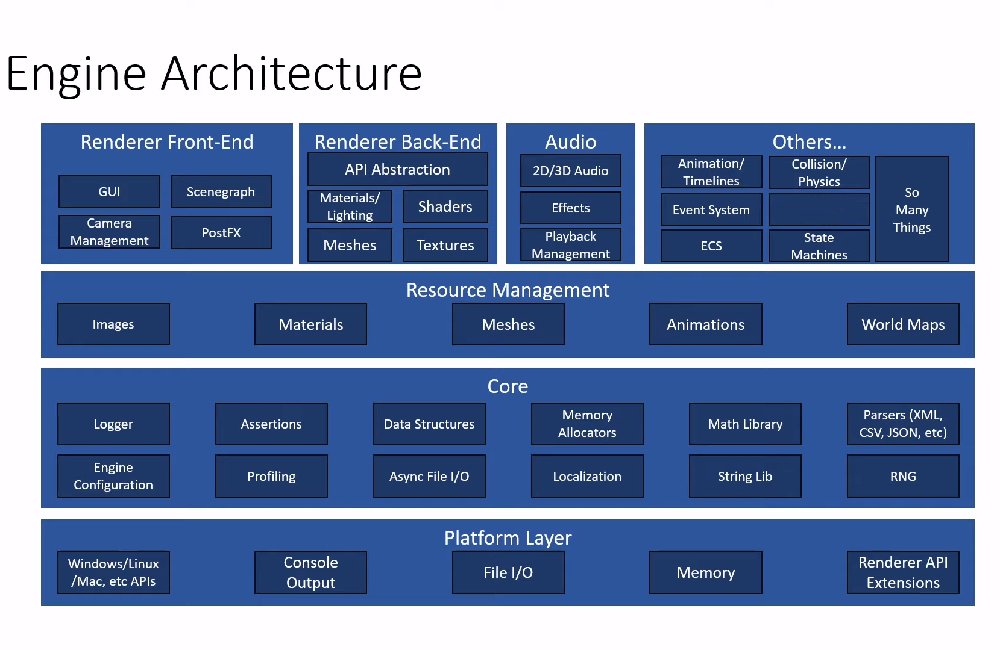
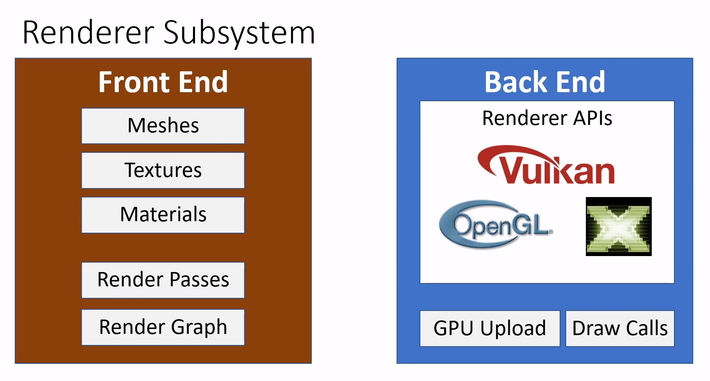

    
    <h1>Phoenix</h1>

# Getting Started Phoenix(C++/C# {src}) (Windows)

    
    
    <h3>Game Engine in C++ and DirectX with WPF Level Editor in Development.</h3>

- Need to have Visual Studio 2022 with `.Net desktop development` and `Desktop development with c++` installed from the visual studio installer.
- Clone or Download the repository. To clone you will need [git](https://git-scm.com/downloads) installed and then open the terminal in the folder you want to clone in and run `git clone https://github.com/Ulrich-Tonmoy/phoenix.git`.
- Then open the `Phoenix.slm` with double click and after it open in the visual studio hit `F5` to run the project.

    
    
    

# Getting Started Phoenix(Clang {src-c}) (Windows/Linux)

    
    <h3>Game Engine with C, in Development.</h3>

- Download [LLVM](https://github.com/llvm/llvm-project/releases) check installation with cmd `clang --version`
- Download [Vulkan](https://vulkan.lunarg.com/#new_tab) check installation with cmd `vulkaninfo`
- Download [Vscode](https://code.visualstudio.com/download)

    
    
    

# Getting Started Phoenix(Zig {src-zig}) (Windows/Linux)

    
    <h3>Game Engine with Zig, in Development.</h3>

- Download [Zig](https://ziglang.org/download/) check installation with cmd `zig version`
